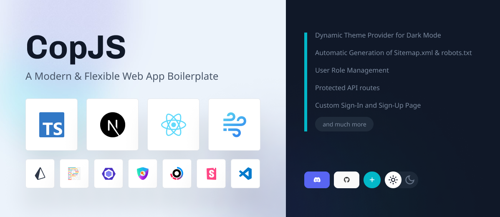
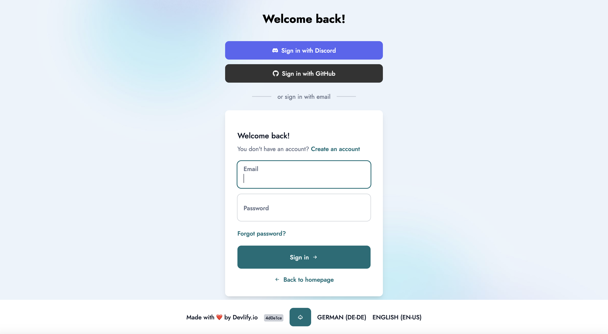

# 🔥 CopJS - Next.js 13.3 Based Boilerplate for Modern Web Applications

  Project Status: No Further Development

<b>Note:</b>This project is no longer being actively developed or maintained. However, it remains available for reference or use.

Please be aware that this project is no longer actively maintained. Feel free to use the existing codebase as-is, but no new features or updates are planned.

Thank you for your interest and support in this project.

  

CopJS is a feature-rich and flexible web application boilerplate built on [Next.js](https://nextjs.org/) 13.3, designed to streamline your development process. With a modern app directory structure and Metadata API, CopJS empowers you to build web applications with ease.

<b>Some notable features of CopJS include:</b>

- <b>Robust Error Handling</b>: CopJS integrates tRPC and zod for handling errors.
- <b>Efficient Database Management</b>: CopJS leverages Prisma as the ORM for seamless and efficient database operations.
- <b>Secure and Scalable</b>: CopJS includes protected routes based on user roles, allowing you to build secure and scalable applications.
- <b>Beautiful UI with Dark/Light Theme</b>: CopJS comes with a built-in ThemeProvider for easy implementation of dark and light modes, offering a visually appealing user interface.

## Dependencies

- [TypeScript](https://www.typescriptlang.org/): 💻 A statically typed, object-oriented programming language that builds on JavaScript.
- [Next.js](https://nextjs.org/): 🚀 A framework for building server-rendered or statically-generated React applications.
- [Turbo](https://turbo.build/): 🏋️‍♀️ High-performance build system for JavaScript and TypeScript codebases.
- [tRPC](https://trpc.io): 🔌 A TypeScript-based RPC framework for building scalable and type-safe APIs with minimal boilerplate.
- [Zod](https://github.com/colinhacks/zod): 🧩 A TypeScript-first schema builder for static type safety.
- [Prisma](https://www.prisma.io/): 🗄️ A powerful and flexible database toolkit that makes it easy to work with databases in your application.
- [Next-Auth](https://next-auth.js.org/): 🔒 A complete authentication solution for Next.js that supports multiple providers and local authentication.
- [Windicss](https://windicss.org/): 🎨 A modern and customizable styling solution for Next.js applications.
- [Storybook](https://storybook.js.org/): 📚 Storybook is a frontend workshop for building UI components and pages in isolation.

## Developer Experience

- 🌍 Internationalization that makes it easy to translate your application
- 💅 [Classnames](https://www.npmjs.com/package/classnames) A utility for conditionally joining class names together
- 📏 [Eslint](https://eslint.org/) Linter (default NextJS, NextJS Core Web Vitals)
- 💖 [Prettier](https://prettier.io/) Code Formatter
- 🦊 Husky for Git Hooks
- 🚫 Lint-staged for running linters on Git staged files
- 🚨 Invalid Environment Variables Check with Zod

## Features

- 🌗 Dynamic Theme Provider for Dark Mode
- 📂 Seamless Absolute Imports using @ Prefix
- 🗂 Customized VSCode Configuration for Better Coding Experience
- 🕰️ Activity tracking with Timestamps added to the Prisma schema
- 🚫 Custom 404 and 500 error pages with localization for improved user experience
- 🔑 User Roles using next-auth with extended session types
- 🛡️ Protected API routes using tRPC and NextAuth with tRPC
- 🔐 User authentication with NextAuth and CredentialsProvider with tRPC, Prisma and zod
- 🔒 Custom Sign-In, Sign-Up Page & Password Reset Page with NextAuth and tRPC with zod
- 🚫 Custom Error Messages for NextAuth Providers
- 🚫 Translated Zod Error Messages

## Built-in Advantages from Next.js

- 🔥 Minimized HTML & CSS
- 💥 Live Reload
- 💯 Cache Busting Guarantee

## Philosophy

- 🔧 The code is minimal, giving you the freedom to make necessary adjustments to fit your needs and preferences.
- 🚀 Production-ready and SEO-friendly

## Screenshot

  

## Getting Started 🚀

Clone the CopJS repository by running the following command in your terminal:

<pre>git clone https://github.com/caglarop/copjs.git</pre>

Navigate into the cloned repository:

<pre>cd copjs</pre>

Install the dependencies by running the following command:

<pre>yarn</pre>

Configure the environment variables by creating a .env file in the root directory and setting the necessary values.

And then sart the development server by running the following command:

<pre>yarn dev</pre>

## Contributors 🤝

Contributions are welcome! If you have an idea for a new feature or find a bug, please open an issue or submit a pull request. 🙏

## License 📄

The CopJS boilerplate is open-source software licensed under the [MIT License](LICENSE). 🎉
